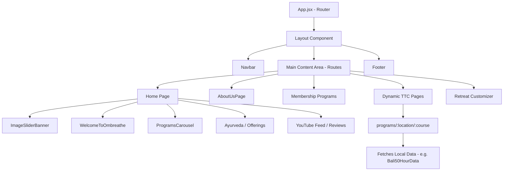

<div align="center">

  

  # 🕉️ Ombreathe
  
  **Your journey to inner peace, wellness, and authentic spiritual transformation.**
  
  *A premium, fully responsive web application built for the **Ombreathe Yoga School & Ashram** — a Yoga Alliance Accredited institution offering immersive teacher training, traditional sadhana programs, customized retreats, and Ayurveda-focused wellness journeys.*

  ---

  [](https://vitejs.dev/)
  [](https://react.dev/)
  [](https://reactrouter.com/)
  [](https://styled-components.com/)
  [](https://getbootstrap.com/)
  
  ---
  
  [Key Features](#-key-features) • [Tech Stack](#%EF%B8%8F-tech-stack--ecosystem) • [Architecture](#%EF%B8%8F-project-architecture) • [Getting Started](#-getting-started--installation) • [Routing Map](#-routing-map)

</div>

---

## 🌸 Project Overview

**Ombreathe** is a state-of-the-art web application designed to connect spiritual seekers, yoga practitioners, and wellness enthusiasts with the authentic teachings of traditional Himalayan Yoga, Ashtanga, Vinyasa, and Ayurveda. 

Accredited by the **Yoga Alliance**, Ombreathe operates ashrams and programs globally, including key hubs in:
- **Rishikesh, India** (The Yoga Capital of the World)
- **Dharamshala, India** (Himalayan serenity)
- **Bali, Indonesia** (Tropical spiritual sanctuary)
- **Chiang Mai, Thailand** (Northern cultural heartland)
- **Goa, India** (Coastal rejuvenation)

---

## 🧘 Key Features

### 1. 🎓 Certified Teacher Training Courses (TTC)
- Immersive residential training programs: **100-Hour, 200-Hour, 300-Hour, and 500-Hour** certifications.
- Interactive curricula spanning Hatha, Vinyasa, Ashtanga, Aerial Yoga, Hasta Yoga, and philosophy.
- Location-specific custom landing pages dynamically rendered for localized course guides.

### 2. 🌀 Sacred Sadhana & Membership Programs
Deep spiritual initiations and practice paths detailed with curated modules, daily schedules, and expectations:
* **Shakti Sadhana**: Reconnecting with the divine feminine creative energy.
* **Shiv Shakti Sadhana**: Harmonizing dual energies (masculine & feminine) within.
* **Sapta Rishi Sadhana**: Transmitting deep, ancient Vedic wisdom and lineage-held secrets.
* **Pashu Patayaa Sadhana**: A nature-immersion experience centered on animal consciousness and ecological wisdom.

### 3. 🗺️ Personalized Yoga Retreats
- **Host Your Retreat**: Tools and forms for independent teachers to coordinate and host custom retreats at Ombreathe locations.
- **Make Your Own Combo**: A dynamic interface allowing practitioners to design customized packages combining yoga, trekking, Ayurvedic therapies, and local sightseeing.

### 4. 🌿 Ayurveda & Holistic Healing Integration
- Structured educational portals showcasing detox programs, diet guidance, and traditional therapies.
- Connections to qualified practitioners and authentic Ayurvedic products.

### 5. 💻 Interactive Tools & Elements
- **AutoTyping Headers**: Sleek, typewriter-style micro-interactions that engage users immediately.
- **Image Slider Banner**: High-resolution carousel showcasing the beauty of the ashrams.
- **YouTube Hub**: Integrated video playlists for self-study and community engagement.
- **Interactive FAQ Accordion**: Clean, smooth accordion providing quick, layout-adaptive answers.
- **WhatsApp Integration**: Floating micro-interaction button offering direct channels to booking managers.

---

## 🛠️ Tech Stack & Ecosystem

| Technology | Purpose | Key Libraries Used |
| :--- | :--- | :--- |
| **Core Framework** | High-performance SPA skeleton | React 19.x & Vite 8.x |
| **Routing** | Dynamic paths and clean URL redirects | React Router Dom 7.x |
| **Styling** | Clean layouts, typography & component isolation | Styled Components, CSS, Bootstrap |
| **Animation & Interactivity** | Polished, smooth scrolling, and typing effects | AOS (Animate on Scroll), React Simple Typewriter |
| **Data Visualization & UI** | Responsive sliders, modern iconography | React Slick, Slick Carousel, Lucide React, React Icons |
| **Form Management** | Direct email delivery for inquiries/bookings | EmailJS Browser |

---

## 🗂️ Project Architecture

The codebase is structured logically to separate global configurations, UI assets, reusable layout wrappers, and domain-specific content (such as `ombYoga` containing retreat and school data).

```text
ombreathe/
├── public/                 # Static assets (favicons, fonts, local scripts)
├── src/
│   ├── Components/         # Reusable UI Components & Sections
│   │   ├── AboutUs/        # About page layouts & founder info
│   │   ├── Banner/         # Main landing sliders & trust banners
│   │   ├── Blog/           # Blog listing and post components
│   │   ├── Footer/         # Legal pages & main Footer
│   │   ├── Header/         # Navigation components
│   │   ├── Services/       # Memberships (Shakti, Shiv Shakti, etc.)
│   │   ├── Teachers/       # Staff cards and profiles list
│   │   └── ...             # FAQ Accordion, WhatsApp buttons, Ayurveda, etc.
│   ├── ombYoga/            # Core Yoga & School Dynamic System
│   │   ├── data/           # Course information by location (Bali, Chiang Mai, Dharamshala)
│   │   ├── pages/          # Landing pages and Course lists
│   │   ├── sections/       # UI sections dedicated to courses (Pricing, Schedule)
│   │   └── styles/         # Custom styling for course modules
│   ├── images/             # Local images, logos, and banners
│   ├── App.jsx             # Core router and page view-tracking layer
│   ├── Layout.jsx          # Shared frame containing Navbar and Footer
│   ├── main.jsx            # Application mount point
│   └── index.css           # Global typography & root resets
├── eslint.config.js        # Linter specifications
├── vite.config.js          # Vite build & plugin configurations
└── package.json            # Scripts & project dependencies
```

---

## ⚡ Component & Flow Diagram

The application leverages dynamic routing to load course landing pages depending on the URL path, fetching localized data on the fly. Here's a high-level representation of the application structure:



---

## 🚀 Getting Started & Installation

> [!NOTE]
> Make sure you have [Node.js](https://nodejs.org/) installed (recommended version `18.x` or higher) along with `npm` or `yarn`.

### 1. Clone the repository
```bash
git clone https://github.com/your-username/ombreathe.git
cd ombreathe
```

### 2. Install dependencies
```bash
npm install
```

### 3. Set up environment variables
Create a `.env` file in the root directory and configure EmailJS keys:
```env
VITE_EMAILJS_SERVICE_ID=your_service_id
VITE_EMAILJS_TEMPLATE_ID=your_template_id
VITE_EMAILJS_PUBLIC_KEY=your_public_key
```

### 4. Run the development server
```bash
npm run dev
```
The app will start at `http://localhost:5173`. Open your browser to begin exploring!

---

## 📜 Available Scripts

In the project directory, you can run the following scripts:

| Command | Action |
| :--- | :--- |
| `npm run dev` | Runs the app in development mode with hot-reloading (HMR). |
| `npm run build` | Builds the app for production to the `dist` folder. |
| `npm run lint` | Runs ESLint to identify code quality or style issues. |
| `npm run preview` | Locally previews the production build. |

---

## 🌐 Routing Map

Ombreathe utilizes a declarative routing architecture under [App.jsx](file:///e:/sugaam/OmbreatheLatest/ombreathe/src/App.jsx). Below are the primary routes available:

| Route Path | Component / Target | Description |
| :--- | :--- | :--- |
| `/` | `Home` | Master landing page with banner sliders, reviews, and dynamic sections. |
| `/about` | `AboutUsPage` | Founder background, school accreditations, and philosophy. |
| `/contact` | `Cont` | Direct messaging form powered by EmailJS and location markers. |
| `/our-teachers-list` | `YogaTeachers` | Profiles of certified masters leading the ashrams. |
| `/programs` | `ProgramsCarousel` | Slider highlighting all upcoming courses and workshops. |
| `/programs/:location` | `LocationLandingPage` | Regional specific details (e.g., `/programs/rishikesh`). |
| `/programs/:location/:course` | `OmbYogaPage` | Specialized TTC courses (e.g., `/programs/bali/200-hour-yoga-ttc`). |
| `/online/:course` | `OnlineYogaPage` | Virtual training courses accessible from anywhere. |
| `/programs/shakti-sadhana` | `MembershipProgram` | Core Shakti energy alignment sadhana details. |
| `/programs/shiv-shakti-sadhana`| `MembershipProgram` | Dual energy harmony teachings. |
| `/retreats/personalize-your-retreat/host-your-retreat` | `HostYourRetreats` | Application page for external retreat hosts. |
| `/retreats/personalize-your-retreat/make-your-own-combo` | `MakeYourOwnCombo` | Flexible, step-by-step combo retreat builder. |

---

## 🤝 Contributing & Code Guidelines

We welcome contributions from the community to improve the Ombreathe experience!

1. Fork the Project.
2. Create your Feature Branch (`git checkout -b feature/AmazingFeature`).
3. Commit your Changes (`git commit -m 'Add some AmazingFeature'`).
4. Push to the Branch (`git push origin feature/AmazingFeature`).
5. Open a Pull Request.

> [!TIP]
> Ensure all code conforms to the project's ESLint configuration by running `npm run lint` prior to submitting any PRs. Use modular CSS or Styled Components rules when modifying layouts to prevent cascading style contamination.

---

<div align="center">
  <sub>Made with ❤️ by the Ombreathe Dev Team. Namaste.</sub>
</div>
